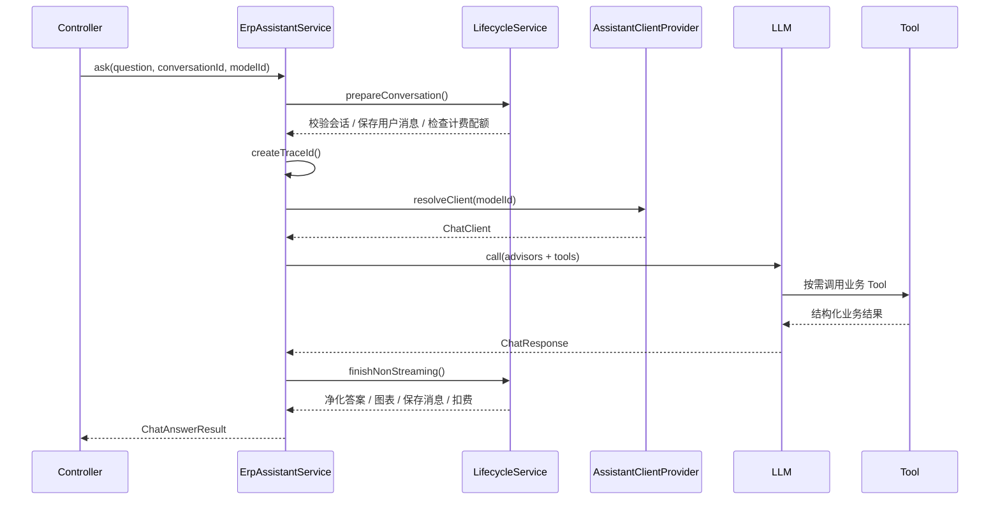

# ERP 智能助手系统设计文档

## 文档信息

| 项目 | 内容 |
|------|------|
| 文档名称 | ERP 智能助手系统设计文档 |
| 项目名称 | Spring AI RAG Demo |
| 文档版本 | v1.0 |
| 编写日期 | 2026-08-28 |
| 文档状态 | 正式 |
| 目标读者 | 研发、测试、运维、架构评审人员 |

---

## 1. 概述

### 1.1 背景与目标

ERP 智能助手是基于 Spring AI 构建的制造业 ERP 智能问答系统。它围绕大语言模型（LLM，Large Language Model）整合两类核心能力：

- **Tool Calling（工具调用）**：让模型按需调用受控工具，实时查询 ERP 业务数据。
- **RAG（检索增强生成，Retrieval-Augmented Generation）**：从向量数据库中检索用户导入的知识文档，增强回答准确性。

系统面向多租户场景，提供对话记忆、流式输出、业务图表可视化、动态工具管理、调用追踪和计费能力。

### 1.2 设计目标

1. **业务数据实时性**：回答不依赖模型训练数据，而是通过工具实时读取 ERP 数据库。
2. **知识可扩展性**：支持上传 PDF、Word、Excel、TXT 等文档并本地向量化检索。
3. **多租户安全隔离**：业务数据、知识文档、对话记录、计费数据均按租户隔离。
4. **可观测与可运营**：记录 Tool 调用流水、Token 用量、耗时，并提供计费能力。
5. **可维护与可演进**：代码按业务域分包，配置集中管理，支持多模型扩展和动态工具扩展。
6. **离线可部署**：嵌入模型和前端依赖均本地化，减少对公网 CDN 和额外服务的依赖。

### 1.3 术语

| 术语 | 说明 |
|------|------|
| LLM | 大语言模型，负责理解用户问题、调用工具并生成最终回答。 |
| Tool Calling | 模型根据工具描述，按需调用后端注册的工具函数。 |
| RAG | 检索增强生成，先检索相关文档片段，再把片段注入提示词生成回答。 |
| PgVector | PostgreSQL 向量扩展，用于存储和检索文档嵌入向量。 |
| Embedding | 文本嵌入，把文本转换成固定维度向量。 |
| ChatMemory | Spring AI 会话记忆，提供多轮上下文。 |
| SSE | Server-Sent Events，服务端单向推送事件流。 |
| ChartSpec | 前后端约定的版本化图表协议，用于描述图表类型、字段绑定和数据。 |
| Tenant | 租户，使用 `ent_code` 标识的数据隔离单位。 |
| ToolSnapshot | 当前运行时可见的 Tool 集合快照。 |

---

## 2. 总体架构

### 2.1 架构概览

系统采用单体 Spring Boot 应用 + 双数据源架构，前后端一体部署。

```mermaid
flowchart LR
    U[浏览器前端] -->|HTTP / SSE| C[Spring Boot 应用]
    C -->|@Primary JDBC| PG[(PostgreSQL + PgVector)]
    C -->|ERP JDBC / MyBatis-Plus| MY[(MySQL ERP)]
    C -->|LLM API| M1[DeepSeek]
    C -->|LLM API| M2[DashScope / OpenAI 兼容]
    C -->|LLM API| M3[Google Gemini]
    C -->|本地 ONNX| E[all-MiniLM-L6-v2 嵌入模型]
```

### 2.2 技术栈

| 层次 | 技术 | 版本 / 说明 |
|------|------|-------------|
| 语言 | Java | 17+ |
| 框架 | Spring Boot | 4.0.7 |
| AI 框架 | Spring AI | 2.0.0 |
| Web | Spring MVC + WebFlux Reactor | MVC 处理 REST，WebFlux 处理 SSE 流 |
| 数据访问 | Spring JDBC + MyBatis-Plus | MyBatis-Plus 3.5.16，仅绑定 ERP 数据源 |
| 向量数据库 | PostgreSQL + PgVector | HNSW 索引，余弦距离，384 维 |
| 业务数据库 | MySQL | 8.0 |
| 嵌入模型 | all-MiniLM-L6-v2 | ONNX Runtime 本地推理，384 维 |
| 对话模型 | DeepSeek / 通义千问 / Gemini | 多模型可切换 |
| 前端 | 原生 HTML / CSS / JS | ECharts、marked.js、highlight.js |
| 构建部署 | Maven + Docker / Docker Compose | 单模块项目 |

### 2.3 架构原则

1. **单一模块、业务域分包**：不拆多模块 Maven 工程，通过包结构表达业务边界。
2. **依赖注入规范**：使用构造器注入和 `private final` 字段，禁止字段 `@Autowired`。
3. **Controller 薄层**：控制器只做参数绑定、调用服务、返回统一响应。
4. **统一响应协议**：REST 接口统一使用 `RespVO<T>`，SSE 接口使用类型化事件。
5. **数据源职责清晰**：PgVector 为主数据源，ERP MySQL 为业务数据源，MyBatis-Plus 不污染向量库。
6. **租户隔离前置**：所有 ERP 查询和向量检索必须经过租户条件注入。
7. **SQL 参数化**：动态值一律使用 `?` 占位符，禁止字符串拼接。
8. **LLM 调用统一路由与计费**：通过 `ModelRegistry` 路由，计费前置校验、后置扣费。

---

## 3. 模块设计

### 3.1 包结构

后端包根路径为 `com.example.rag`。

```text
com.example.rag
├── RagDemoApplication              应用启动类
├── chat/                           AI 对话核心
│   ├── ErpAssistantService        问答编排服务
│   ├── DocumentLoaderService      文档加载与向量入库
│   ├── ModelRegistry              多模型注册与路由
│   ├── client/                    ChatClient 提供与 Tool 装配
│   ├── lifecycle/                 问答生命周期收口
│   ├── dto/                       对话内部数据对象
│   ├── output/                    回答净化
│   ├── guard/                     业务数据守卫
│   └── chart/                     图表可视化管线
├── controller/                    REST 入口
├── conversation/                  对话历史与会话记忆
├── billing/                       计费与用量
├── tenant/                        租户管理
├── tool/                          ERP Tool Calling
│   ├── admin/                     动态工具管理
│   ├── dynamic/                   动态 SQL 工具执行
│   ├── registry/                  Tool 快照注册
│   └── trace/                     Tool 调用追踪
├── dao/                           Entity 与 Mapper
├── init/                          数据库初始化
├── config/                        基础设施配置
└── vo/                            请求与响应对象
```

### 3.2 核心模块职责

| 模块 | 主要类 | 职责 |
|------|--------|------|
| 问答编排 | `ErpAssistantService` | 根据 `auto`、`data`、`knowledge` 三种模式组合 Tool、RAG、会话记忆并调用模型。 |
| 客户端装配 | `AssistantClientProvider` | 管理系统提示词、多模型客户端、Tool 装配和缓存。 |
| 生命周期 | `AssistantLifecycleService` | 会话准备、消息持久化、计费、Tool 流水、流式事件转换和取消收口。 |
| 多模型路由 | `ModelRegistry` | 将 `modelId` 映射到具体 provider 的 `ChatClient`。 |
| 文档处理 | `DocumentLoaderService` | 用 Tika 解析文档、切分、向量化并写入 PgVector。 |
| 会话记忆 | `JdbcChatMemoryRepository` | 从数据库加载历史消息，实现持久化 ChatMemory。 |
| 动态工具 | `ToolRegistryService` | 合并代码 Tool 与数据库动态 Tool，维护 `ToolSnapshot`。 |
| 动态 SQL 执行 | `database` 子包 | 校验 SQL、绑定参数、注入租户、执行只读查询。 |
| 调用追踪 | `trace` 子包 | 记录每次 Tool 调用的入参、状态、耗时和结果规模。 |
| 图表管线 | `chart` 子包 | 捕获结果、选择图表、编译协议、校验和持久化。 |

---

## 4. 核心流程设计

### 4.1 问答模式

系统支持三种问答模式，由前端传入 `mode` 参数。

| 模式 | Tool Calling | RAG | 适用场景 |
|------|--------------|-----|----------|
| `auto` | 启用 | 启用 | 同时支持查业务数据和产品知识问答。 |
| `data` | 启用 | 禁用 | 明确的 ERP 业务数据查询。 |
| `knowledge` | 禁用 | 启用 | 仅基于知识文档回答。 |

### 4.2 非流式问答时序



### 4.3 流式问答

流式接口使用 SSE，事件类型如下：

| 事件类型 | 说明 |
|----------|------|
| `delta` | 增量文本内容。 |
| `chart` | 可空图表协议，通常在整个回答结束时返回。 |
| `done` | 正常结束，含 `conversationId`、token 用量等元数据。 |
| `error` | 异常结束，含错误码和错误信息。 |

流式链路由 `BusinessDataTurnGuard.ensureStreaming()` 处理：若首次响应在最终回答前未获得本轮业务 Tool 结果，则最多重试一次，避免模型直接复用历史业务数字。

### 4.4 Tool Calling 流程

1. `ToolRegistryService` 在应用就绪后加载代码 Tool 和启用状态的动态数据库 Tool，构建 `ToolSnapshot`。
2. `AssistantClientProvider` 将 Tool 快照装配到对应模型的 `ChatClient`。
3. 模型根据 Tool 描述决定是否调用工具。
4. `ToolContext` 传递当前 `traceId`、`conversationId`、`mode`、模型名和租户信息。
5. `ToolCallRecorder` 捕获本轮 Tool 调用，`ToolCallLogService` 持久化调用流水。
6. `ToolResultRecorder` 捕获结构化业务结果，供图表编译使用。

### 4.5 RAG 流程

1. 用户上传或加载文档。
2. `DocumentLoaderService` 使用 Tika 读取内容，`TokenTextSplitter` 切分，调用本地嵌入模型生成向量。
3. 文档元数据中写入 `ent_code`。
4. 问答时通过 `QuestionAnswerAdvisor` 检索向量库。
5. 检索请求显式拼接 `ent_code` 过滤条件，保证租户隔离。
6. 召回片段注入提示词上下文，模型基于片段回答。

### 4.6 图表可视化流程

1. 当前轮 Tool 返回结构化业务数据。
2. `ToolResultRecorder` 捕获可用的业务结果。
3. LLM 通过内部 `ChartPlanToolCallback` 仅选择图表类型和标题，不直接生成 ECharts 配置。
4. `ChartPlanFactory` 生成内部图表规划。
5. `ChartCompiler` 从真实业务数据中选择来源、绑定字段、执行受控转换并生成 `ChartSpec`。
6. `ChartSpecCodec` 校验版本、字段、行数和字节上限。
7. 图表随助手消息持久化，历史记录和续聊可直接回放。
8. 前端使用本地 ECharts 渲染图表。

图表失败时自动降级为 Markdown 文本，不影响原业务回答。

### 4.7 计费流程

1. LLM 调用前执行 `BillingService.checkQuota()`，校验余额、月度配额和账户状态。
2. LLM 调用后获取 `Usage`，执行 `BillingService.deductTokens()`。
3. 按模型计价规则计算输入、输出 token 费用。
4. 更新每日用量汇总和月度用量汇总。
5. 写入计费交易流水，更新账户余额。

计费扣费在独立事务中执行，避免和第三方 LLM 长耗时调用处于同一本地事务。

---

## 5. 数据模型设计

数据库分为两类：

- **PgVector**：存储知识文档向量。
- **MySQL**：存储 ERP 业务数据、平台会话数据、计费数据和动态工具配置。

### 5.1 MySQL 平台表

平台表位于 `a_` 前缀命名空间。

| 表名 | 说明 |
|------|------|
| `a_tenant` | 租户信息。 |
| `a_tenant_user` | 租户用户。 |
| `a_chat_conversation` | 对话会话。 |
| `a_chat_message` | 对话消息。 |
| `a_token_usage_daily` | 每日 Token 用量汇总。 |
| `a_token_usage_monthly` | 月度 Token 用量汇总。 |
| `a_billing_plan` | 计费套餐。 |
| `a_billing_price_rule` | 模型计价规则。 |
| `a_billing_account` | 租户计费账户。 |
| `a_billing_transaction` | 计费交易流水。 |
| `a_billing_invoice` | 月度账单。 |
| `a_llm_tool` | 动态 LLM Tool 定义。 |
| `a_tool_call_log` | Tool 调用流水。 |

### 5.2 MySQL ERP 业务表

业务表位于 `b_` 前缀命名空间，按模块组织。

| 模块 | 表名 | 说明 |
|------|------|------|
| 销售 | `b_sales_order` | 销售订单主表 |
| 销售 | `b_sales_order_detail` | 销售订单明细 |
| 销售 | `b_shipment` | 发货与物流 |
| 销售 | `b_accounts_receivable` | 应收账款 |
| 采购 | `b_purchase_order` | 采购订单主表 |
| 采购 | `b_purchase_order_detail` | 采购订单明细 |
| 采购 | `b_purchase_receive` | 采购收货 |
| 采购 | `b_accounts_payable` | 应付账款 |
| 生产 | `b_work_order` | 生产工单 |
| 生产 | `b_work_order_material` | 工单用料 |
| 生产 | `b_work_order_routing` | 工单工序报工 |
| 仓库 | `b_inventory` | 库存 |
| 仓库 | `b_stock_movement` | 出入库流水 |
| 质检 | `b_quality_inspection` | 质检记录 |
| 质检 | `b_quality_defect_detail` | 质检不良明细 |
| 售后 | `b_after_sales_ticket` | 售后工单 |
| 售后 | `b_return_order` | 退换货 |
| 财务 | `b_finance_ledger` | 财务总账 |
| 财务 | `b_payment_record` | 收款记录 |
| 委外 | `b_outsourcing_order` | 委外加工订单 |
| 委外 | `b_outsourcing_material_flow` | 委外来料退料流水 |

### 5.3 租户隔离字段

除全局配置表外，绝大多数表包含 `ent_code` 字段：

- 平台表通过 MyBatis-Plus 租户插件自动追加 `ent_code` 条件。
- ERP 业务表通过 `BaseTool` 查询方法自动追加 `AND ent_code = ?`。
- 全局配置表 `a_billing_plan`、`a_billing_price_rule`、`a_llm_tool` 不包含租户字段，在租户插件中显式忽略。

---

## 6. API 设计

### 6.1 统一响应结构

REST 接口统一返回 `RespVO<T>`：

```json
{
  "success": true,
  "errCode": null,
  "errMsg": null,
  "data": {}
}
```

业务错误通过 `success=false`、`errCode`、`errMsg` 传递，HTTP 状态通常保持 200。主要错误码：

| 错误码 | 含义 |
|--------|------|
| `BIZ_ERROR` | 业务异常，如配额不足、账户暂停。 |
| `PARAM_ERROR` | 参数校验失败。 |
| `SYSTEM_ERROR` | 系统内部错误。 |
| `NOT_FOUND` | 静态资源不存在。 |
| `CLIENT_DISCONNECTED` | 客户端断开连接。 |

### 6.2 主要接口

#### 对话与文档

| 方法 | 路径 | 说明 |
|------|------|------|
| GET | `/api/ask` | 非流式问答 |
| GET | `/api/ask/stream` | SSE 流式问答 |
| GET | `/api/models` | 可用模型列表 |
| GET | `/api/hints` | 预置示例问题 |
| GET | `/api/search` | 文档向量检索 |
| POST | `/api/load` | 加载预置文档 |
| POST | `/api/upload` | 上传文档 |

#### 会话历史

| 方法 | 路径 | 说明 |
|------|------|------|
| GET | `/api/conversations` | 查询会话列表 |
| GET | `/api/conversations/{id}/messages` | 查询会话消息 |
| DELETE | `/api/conversations/{id}` | 归档会话 |

#### 计费

| 方法 | 路径 | 说明 |
|------|------|------|
| GET | `/api/billing/account` | 查询计费账户 |
| GET | `/api/billing/plans` | 查询套餐 |
| GET | `/api/billing/transactions` | 查询交易流水 |
| POST | `/api/billing/recharge` | 充值 |
| GET | `/api/billing/usage/daily` | 每日用量 |
| GET | `/api/billing/usage/monthly` | 月度用量 |

#### 管理接口

| 方法 | 路径 | 说明 |
|------|------|------|
| GET / POST / PUT | `/api/admin/billing/plans` | 套餐配置管理 |
| GET / POST / PUT | `/api/admin/billing/price-rules` | 计价规则管理 |
| GET / POST / PUT | `/api/admin/billing/invoices` | 账单管理 |
| GET / POST / PUT | `/api/admin/tenants` | 租户管理 |
| GET / POST / PUT | `/api/admin/tenants/users` | 租户用户管理 |
| GET / POST / PUT / DELETE | `/api/admin/tools` | 动态 Tool 管理 |
| POST | `/api/admin/tools/refresh` | 刷新 Tool 快照 |
| GET | `/api/admin/tools/call-logs` | Tool 调用流水 |

---

## 7. 前端设计

前端为原生单页应用，位于 `src/main/resources/static/`。

| 文件 | 说明 |
|------|------|
| `index.html` | 页面结构，包含对话、历史、计费、工具管理四个标签页。 |
| `app.js` | 业务逻辑、SSE 处理、Markdown 渲染、API 调用封装。 |
| `style.css` | 页面样式，颜色和圆角通过 CSS 变量管理。 |
| `chart-adapter.js` | 将 `ChartSpec` 转换为 ECharts 配置。 |
| `vendor/` | 本地第三方库。 |

前端关键约定：

- API 统一使用 `apiCall()` / `apiPost()`，自动附加租户头并解包 `RespVO`。
- 所有 `/api/**` 请求通过 `getHeaders()` 注入 `X-Ent-Code` 和 `X-User-Id`。
- 动态内容拼入 HTML 前必须转义，防止 XSS。
- 修改静态资源后更新 `index.html` 中的 `?v=N` 缓存版本号。
- 前端不依赖 CDN，图表和 Markdown 依赖均本地加载。

---

## 8. 安全设计

### 8.1 多租户隔离

- `TenantFilter` 拦截 `/api/**` 请求，读取 `X-Ent-Code`。
- 缺失租户头时返回 400，拒绝请求。
- `TenantContext` 使用 `ThreadLocal` 保存租户和用户。
- 异步响应式链路通过 `TenantContextAccessor` 透传租户上下文。
- 请求结束清理 `ThreadLocal`，避免线程池复用导致数据串租户。

### 8.2 SQL 注入防护

- 代码 Tool 和动态 Tool 统一使用参数绑定。
- 动态 SQL Tool 只允许单层只读 `SELECT`。
- 拒绝写入、DDL、多语句、复杂查询块和非法主表别名。
- 动态 Tool 强制注入当前租户的 `ent_code` 条件。

### 8.3 提示词与数据安全

- `BusinessDataTurnGuard` 阻止模型复用历史回答中的业务数字。
- `AssistantAnswerSanitizer` 过滤模型内部旁白，只保留面向用户的回答。
- 全局异常处理对外隐藏系统内部错误细节。
- API Key 通过环境变量注入，不写入源码或镜像层。

### 8.4 前端安全

- 用户动态内容输出前进行 HTML 转义。
- 图表协议由后端生成并校验，前端只负责渲染，降低 XSS 和恶意配置风险。

---

## 9. 性能与可靠性设计

### 9.1 性能

- 会话记忆只保留最近 20 条消息，控制上下文长度。
- 动态 Tool 支持 `result_limit` 限制返回行数。
- 图表协议限制为最大 60 KB、50 行、32 维，避免超大响应。
- 示例问题按 Tool 快照版本缓存，避免重复调用 LLM。
- 向量检索使用 HNSW 索引和余弦距离。

### 9.2 可靠性

- 数据模式缺失本轮业务结果时最多重试一次。
- 图表生成失败时自动降级为文本，不影响主回答。
- 流式回答支持客户端取消，服务端统一处理正常、异常和取消三种终止状态。
- 数据库初始化幂等，重复启动不会破坏已有数据。

### 9.3 可观测性

- 记录 Tool 调用入参、状态、耗时、结果数、错误摘要。
- 记录消息 Token 用量、耗时、模型、模式和 RAG 文档数。
- 关键业务异常和系统异常通过日志记录。
- 提供 Tool 调用流水查询接口。

---

## 10. 部署设计

### 10.1 运行依赖

| 组件 | 说明 |
|------|------|
| PostgreSQL + PgVector | 向量数据库，默认 `localhost:5432/rag_demo`。 |
| MySQL | ERP 业务库、对话、计费数据，默认 `localhost:13306/erp`。 |
| LLM API Key | 至少配置一个模型服务商。 |

### 10.2 环境变量

| 变量 | 说明 |
|------|------|
| `DEEPSEEK_API_KEY` | DeepSeek API Key |
| `DASHSCOPE_API_KEY` | DashScope / OpenAI 兼容 API Key |
| `GOOGLE_GENAI_API_KEY` | Google Gemini API Key |
| `ERP_DB_USER` | ERP 数据源用户名，默认 `root` |
| `ERP_DB_PASSWORD` | ERP 数据源密码 |
| `SPRING_DATASOURCE_PGVECTOR_URL` | PgVector 连接地址 |
| `SPRING_DATASOURCE_ERP_URL` | ERP 数据源连接地址 |

### 10.3 容器化

- `Dockerfile` 使用多阶段构建，构建阶段为 Maven，运行阶段为 JRE 17。
- `docker-compose.yml` 编排 `app`、`pgvector`、`mysql` 三个服务。
- `pgvector` 和 `mysql` 配置数据卷和健康检查。
- `app` 依赖中间件健康后启动。

---

## 11. 非功能需求

| 类别 | 要求 |
|------|------|
| 可用性 | 单个中间件故障不应影响无关联功能，容器配置自动重启。 |
| 扩展性 | 新增模型 provider 通过配置和依赖扩展，无需修改核心编排逻辑。 |
| 安全性 | 多租户隔离、SQL 注入防护、XSS 防护、API Key 环境变量管理。 |
| 可维护性 | 业务域分包、统一响应协议、统一编码规范。 |
| 可测试性 | 核心服务具备单元测试，前端静态资源具备契约测试。 |
| 兼容性 | Java 17+，主流浏览器，Docker 环境。 |
| 性能 | 单轮问答响应控制在合理范围，通过缓存、限行和窗口控制资源消耗。 |

---

## 12. 风险与演进方向

### 12.1 已知风险

| 风险 | 影响 | 缓解措施 |
|------|------|----------|
| LLM 输出不稳定 | 可能漏调用 Tool 或生成非预期内容 | 有界重试、回答净化、图表降级。 |
| 动态 SQL 安全 | 恶意 SQL 可能造成越权或资源消耗 | 只读校验、参数绑定、租户注入、返回行数限制。 |
| 多租户上下文丢失 | 异步链路可能读不到租户信息 | `TenantContextAccessor` 透传。 |
| 上下文窗口过长 | Token 成本上升、响应变慢 | 会话窗口限制为 20 条消息。 |
| 图表数据超限 | 大结果集可能导致响应过大 | 协议行数、维度、字节数限制。 |

### 12.2 演进方向

1. 引入鉴权与统一网关，替代当前仅依赖 Header 的租户识别。
2. 增加权限模型，细化工具级和管理接口级权限。
3. 引入消息队列或任务系统处理账单生成、用量归档等离线任务。
4. 增加指标采集和集中式日志，接入监控告警体系。
5. 将图表协议扩展为更通用的报表能力。
6. 引入模型调用熔断、降级和限流。

---

## 附录 A：关键配置示例

`application.yml` 中多模型配置结构：

```yaml
app:
  models:
    - id: deepseek-chat
      label: DeepSeek Chat（通用）
      provider: deepseek
      model-name: deepseek-chat
      default: true
```

`id` 用于前端传参，`provider` 对应 Spring AI ChatModel Bean，`model-name` 是实际传给服务商 API 的模型标识。

## 附录 B：目录索引

| 目录 | 说明 |
|------|------|
| `src/main/java` | 后端源码 |
| `src/main/resources/application.yml` | 应用配置 |
| `src/main/resources/static` | 前端资源 |
| `src/main/resources/db/init` | 数据库初始化脚本 |
| `src/main/resources/models/embedding` | 本地嵌入模型 |
| `src/test` | 单元测试与集成测试 |
| `openspec` | 规格驱动开发文档 |
| `deploy` | Maven 镜像源配置 |
| `doc` | 演示素材 |
| `docs` | 项目文档和日志 |
